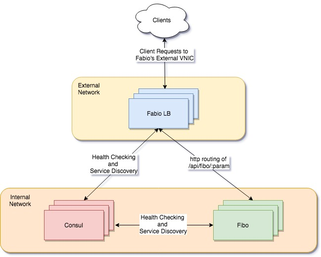

# rest-fibo
a http endpoint that returns an array that contains fibonachii sequence using the [autopilot pattern](http://autopilotpattern.io/).  check out more examples of the autopilot pattern on https://github.com/autopilotpattern/.  this approach to orchestratin is scheduler agnostic, meaning we can port this application to anywhere where we have unix and ip networking.  my preference of course it to run this on triton because of the networking performance and security.  networking virtualization on triton allows us to mix top of rack rabrics with overlay fabrics, a spoil i've come to love.

# built with
- [bunyan](https://github.com/trentm/node-bunyan)
- [prometheus](https://prometheus.io/)
- [consul](https://www.consul.io/)
- [containerpilot](https://www.joyent.com/containerpilot)
- [docker](https://www.docker.com/)
- [fabio](https://github.com/fabiolb/fabio)
- [nodejs](https://nodejs.org/)
- [restify](http://restify.com/)
- [triton cloud](https://www.joyent.com/triton/compute)

# diagram


# run it locally in docker

#### required pre-req's:
- [docker](https://www.docker.com/)
- [docker-compose](https://github.com/docker/compose)
- [httpie](https://github.com/jakubroztocil/httpie)
- [git](https://git-scm.com/)
- [gnumake](https://www.gnu.org/software/make/)

#### clone, build, deploy, scale
```
git clone https://github.com/Smithx10/rest-fibo
cd rest-fibo
make local-build
make local-up
make local-scale-up
make local-scale-down
```
#### watch a video!!!!

on osx: 
[](https://asciinema.org/a/NhfSFZQgyO32zQpNu6b0nqkr9)

on ubuntu 16.04:
[](https://asciinema.org/a/CE12ArLrNtmQ7K0wJCCMH87Lc)

#### request examples

```
bruce.smith@Bruces-MacBook-Pro /g/f/rest-fibo ❯❯❯ http localhost/api/fibo/10                                                                                         ⏎ master ✱ ◼
HTTP/1.1 200 OK
Content-Length: 29
Content-Type: application/json
Date: Sun, 22 Apr 2018 00:38:35 GMT
Server: fibo-api

"[0,1,1,2,3,5,8,13,21,34,55]"

bruce.smith@Bruces-MBP /g/f/rest-fibo ❯❯❯ http localhost/api/fibo/-4

HTTP/1.1 409 Conflict
Content-Length: 87
Content-Type: application/json
Date: Sat, 21 Apr 2018 07:16:54 GMT
Server: fibo-api

{
    "code": "InvalidArgument",
    "message": "The Parameter provided is not a Positive Number."
}
```

# run it on triton 
#### required pre-reqs
- [triton-docker-cli](https://github.com/joyent/triton-docker-cli)
- account on [joyent](https://www.joyent.com/)
- [httpie](https://github.com/jakubroztocil/httpie)

_note: in the docker-compose.yml the consul ports are exposed to the external facing vlan, in production you should not do this._


#### video !!!!

on triton:
[](https://asciinema.org/a/bThWuVdzIScXbOdMiv5Vq5758)

#### clone, build, deploy, scale
```
bruce.smith@Bruces-MacBook-Pro /g/f/rest-fibo ❯❯❯ make triton-build                                                                                                      master ◼ triton-docker build -f fibo/Dockerfile -t=smithx10/fibo:latest .
Sending build context to Docker daemon  3.17 MB
Step 1/11 : FROM node:latest
 ---> aa3e171e4e95
Step 2/11 : ENV CONTAINERPILOT=/etc/containerpilot.json5
 ---> Using cache
 ---> 0f727e68b769
Step 3/11 : RUN apt-get update     && apt-get install -y         bash         curl         make         unzip         python     && mkdir -p /opt/local/fibo
 ---> Using cache
 ---> ab528e3cc585
Step 4/11 : RUN export JQ_VER=1.5      && export JQ_SHA256=c6b3a7d7d3e7b70c6f51b706a3b90bd01833846c54d32ca32f0027f00226ff6d      && export JQ_URL=https://github.com/stedolan/jq/r
eleases/download/jq-${JQ_VER}/jq-linux64      && curl -Ls --fail -o /bin/jq ${JQ_URL}      && echo "${JQ_SHA256} /bin/jq" | sha256sum -c      && chmod +x /bin/jq
 ---> Using cache
 ---> 634258a2d394

make triton-up
bruce.smith@Bruces-MacBook-Pro /g/f/rest-fibo ❯❯❯ make triton-up                                                                                                         master ◼
triton-compose -f examples/triton/docker-compose.yml -p fibo scale consul=3 fabio=3 fibo=3
Creating and starting fibo_consul_1 ... done
Creating and starting fibo_consul_2 ... done
Creating and starting fibo_consul_3 ... done
Creating and starting fibo_fabio_1 ... done
Creating and starting fibo_fabio_2 ... done
Creating and starting fibo_fabio_3 ... done
Creating and starting fibo_fibo_1 ... done
Creating and starting fibo_fibo_2 ... done
Creating and starting fibo_fibo_3 ... done

bruce.smith@Bruces-MacBook-Pro /g/f/rest-fibo ❯❯❯ triton instance resize fibo_consul_1 sample-8G                                                                       ⏎ master ◼
Resizing instance fibo_consul_1 to "sample-8G"
Resized instance fibo_consul_1 to "sample-8G"

bruce.smith@Bruces-MacBook-Pro /g/f/rest-fibo ❯❯❯ triton-compose -f examples/triton/docker-compose.yml -p fibo scale consul=5 fabio=4 fibo=8                           ⏎ master ◼
Creating and starting fibo_consul_4 ... done
Creating and starting fibo_consul_5 ... done
Creating and starting fibo_fabio_4 ... done
Creating and starting fibo_fibo_4 ...
Creating and starting fibo_fibo_5 ...
Creating and starting fibo_fibo_6 ...
Creating and starting fibo_fibo_7 ...
Creating and starting fibo_fibo_8 ...

bruce.smith@Bruces-MacBook-Pro /g/f/rest-fibo ❯❯❯ make triton-down                                                                                                   ⏎ master ✱ ◼
triton-compose -f examples/triton/docker-compose.yml -p fibo down
Stopping fibo_fibo_8 ...
Stopping fibo_fibo_4 ...
Stopping fibo_fibo_5 ...
Stopping fibo_fibo_7 ...
Stopping fibo_fibo_6 ...
Stopping fibo_fabio_4 ...
Stopping fibo_consul_5 ...
Stopping fibo_consul_4 ...
Stopping fibo_fibo_1 ...
Stopping fibo_fibo_3 ...
Stopping fibo_fibo_2 ...
Stopping fibo_fabio_3 ...
Stopping fibo_fabio_2 ...
Stopping fibo_fabio_1 ...
Stopping fibo_consul_1 ...
Stopping fibo_consul_2 ...
Stopping fibo_consul_3 ...
```
#### request examples
```
bruce.smith@Bruces-MacBook-Pro /g/f/rest-fibo ❯❯❯ http fibo.svc.smith.tritonhost.com/api/fibo/40                                                                         master ◼
HTTP/1.1 200 OK
Content-Length: 223
Content-Type: application/json
Date: Sun, 22 Apr 2018 00:37:23 GMT
Server: fibo-api

"[0,1,1,2,3,5,8,13,21,34,55,89,144,233,377,610,987,1597,2584,4181,6765,10946,17711,28657,46368,75025,121393,196418,317811,514229,832040,1346269,2178309,3524578,5702887,9227465,14930352,24157817,39088169,63245986,102334155]"
```


# metrics
currently fibo will advertise restify prometheus metrics on :8080/metrics. i plan on adding prometheus endpoints to all of the applications.

# todo
- k8s deployment
- triton cloud instructions
- tls & secrets all of the things
- autogen documentation with something like [swagger-restify](https://www.npmjs.com/package/swagger-restify)
- add prometheus endpoints to fabio and consul
- operational tests (ex. network partitions, node failures, etc)
- automate the process with a free ci/cd platform
- rotate log data to Manta / Object storage
- cleanup the makefile to do proper versioning with the ci/cd platform
- add pretty graphs with mermaid, maybe?
- add prometheus metrics to all the applications

# developing rest-fibo
if you wish to work on rest-fibo itself, you'll first need [nodejs](https://nodejs.org/) installed. All the modules used should work 6.9.0 and newer. The [dtrace-provider](https://github.com/chrisa/node-dtrace-provider) will require [gnumake](https://www.gnu.org/software/make/) and [python](https://www.python.org/) to build.    


#### environment variables
by default _rest-fibo_ will log to */var/log/* if your local env doesn't have perms you can override this by setting FIBO_LOGPATH to your desired path.

#### example

```
git clone https://github.com/Smithx10/rest-fibo
cd rest-fibo/fibo/src
npm install
mkdir -p ~/var/log
export FIBO_LOGPATH=~/var/log
node api.js
```
at this point you should be able to hit the endpoint on localhost:8080/api/fbo/:param
```
bruce.smith@Bruces-MacBook-Pro /g/f/r/fibo ❯❯❯ http localhost:8080/api/fibo/4                                                                                          ⏎ master ✱
HTTP/1.1 200 OK
Connection: keep-alive
Content-Length: 13
Content-Type: application/json
Date: Sat, 21 Apr 2018 19:46:39 GMT
Server: fibo-api

"[1,1,2,3,5]"
```
# debugging and observability
fibo will dump core on an uncaught exception.  we can debug this core dump using the v8 ustack helper in [mdb](https://illumos.org/man/1/mdb). processes and procedures can be found at https://www.joyent.com/blog/debugging-nodejs-with-mdb. the obvious benefit here is that the service will come back online and we can root cause post-mortem. here is a video more about why you need this.  https://www.youtube.com/watch?v=O1YP8QP9gLA
restify has dtrace-probes built into the library, this will allow us to instrument and debug restify without having to change / rebuild.  more about dtrace can be found at http://dtrace.org/guide/chp-intro.html and http://restify.com/docs/dtrace/ and pretty much everywhere.  It is *awesome*
